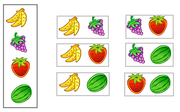

## Лекция 2. Перестановки, сочетания, размещения

###[Перестановки](../../GLOSSARY.md#перестановки)

Пусть имеется n различных объектов. Будем переставлять их всеми различными способами ( число и состав объектов остается неизменным, меняется только порядок). Получившиеся комбинации называются перестановками, а их число равно 

$$ P_n = n! = 1⋅2⋅3⋅...⋅(n−1)⋅n $$

Символ $$n!$$ называется факториалом и обозначает произведение всех целых чисел от 1 до n. По определению считают, что $$0! = 1$$, $$1! = 1$$. Факториал растет очень быстро (недаром он обозначается восклицательным знаком !), например:

$$10!=3628800$$

*Пример:* Сколько способов рассадить шестерых гостей на шести стульях? 

*Решение.*
$$P_6 = 6! = 1⋅2⋅3⋅4⋅5⋅6 = 720$$

### Перестановки с повторениями

$$ (P_n)_{повт.} = {n! \over n_1!⋅n_2!⋅...⋅n_k!} $$

*Задача1.* Сколько различных “слов” можно получить, переставляя буквы слова “передача” ?

В этом слове буквы “е” и “а” встречаются два раза, остальные по одному разу. Речь идет о перестановке с повторением состава (2,2,1,1,1,1) длины n равно 2+2+1+1+1+1=8. Количество таких [перестановок](../../GLOSSARY.md#перестановки) равно

$$ (P_8)_{повт.}(2,2,1,1,1,1) = {8! \over 2!⋅2!⋅1!⋅1!⋅1!⋅1!} = 10080 $$

###Сочетания

В [комбинаторике](../../GLOSSARY.md#комбинаторика) сочетанием из $$n$$ по $$m$$ называется набор $$m$$ элементов, выбранных из данных $$n$$ элементов. Наборы, отличающиеся только порядком следования элементов (но не составом), считаются одинаковыми, этим сочетания отличаются от размещений.

Пусть имеется $$n$$ различных объектов. Чтобы найти число **сочетаний** из $$n$$ объектов по $$m$$, будем выбирать комбинации из $$m$$ объектов всеми возможными способами, при этом будем обращать внимание на разный состав комбинаций, но не порядок (он тут не важен). Например, есть три объекта {1,2,3}, составляем сочетания по 2 объекта в каждом. Тогда [выборки](../../GLOSSARY.md#выборка) {1,2} и {2,1} - это одно и то же сочетание (так как комбинации отличаются лишь порядком). А всего различных сочетаний из 3 объектов по 2 будет три: {1,2}, {1,3}, {2,3}.

На картинке наглядно проиллюстрировано получение всех возможных сочетаний из 4 различных объектов по 2 

Формула  для нахождения числа сочетаний имеет вид

$$ C_n^m = {n! \over m!(n - m)!} $$

*Задача2.* Сколько существует способов назначить двоих дежурных из семи человек?

*Решение.*

$$ C_7^2 = {7! \over 2!(7 - 2)!} = {7! \over 2!⋅5!} = {1⋅2⋅3⋅4⋅5⋅6⋅7 \over 1⋅2⋅1⋅2⋅3⋅4⋅5} = 21 $$

**Сочетания с повторениями** – это комбинации, составленные из $$n$$ различных элементов по $$m$$ элементов, среди которых встречаются одинаковые. Комбинации отличаются хотя бы одним элементом. Формула для вычисления числа сочетаний с повторениями:

$$ (C_n^m)_{повт.} = C_{n+m-1}^m = {(n+m-1)! \over m!(n-1)!}  $$

*Задача3.* В кондитерском магазине продается 4 сорта пирожных: наполеон, эклеры, песочные и слоеные. Сколькими способами можно купить 7 пирожных?

*Решение.*	

$$  (C_4^7)_{повт.} = C_{4+7-1}^7 = C_{10}^7 = {10! \over 7!⋅3!} =120 $$

### [Размещения](../../GLOSSARY.md#размещения)

Пусть имеется $$n$$ различных объектов.

Будем выбирать из них $$m$$ объектов и переставлять всеми возможными способами между собой (то есть меняется и состав выбранных объектов, и их порядок). Получившиеся комбинации называются **размещениями** из $$n$$ объектов по $$m$$, а их число равно

$$  A_n^m = {n! \over (n-m)!} $$

Чтобы найти размещения, надо взять все возможные сочетания, а потом в каждом еще поменять порядок всеми возможными способами (то есть фактически сделать еще перестановки). Поэтому число размещений еще выражается через число перестановок и сочетаний так:

$$ A_n^m = C_n^m ⋅ P_m $$

*Задача4.* В группе туристов 9 человек. Сколько существует способов распределить между ними обязанности командира, его заместителя и кашевара? 

*Решение.*   $$ A_9^3 = {9! \over (9-3)!} = {9! \over 6!} = {6!⋅7⋅8⋅9 \over 6! } =504 $$

Если n различных элементов могут повториться m раз, оказавшись соответственно на m местах, то **число размещений с повторениями** вычисляется по формуле

$$ (A_n^m)_{повт.} = n^m $$

*Задача5.* Сколько трехзначных чисел можно записать, используя любые цифры из набора 1,2,3,4,5?

*Решение.*  $$ (A_5^3) =5^3 = 125 $$

### Основные элементы комбинаторики

**Размещения**   $$  A_n^m = {n! \over (n-m)!} $$

Это любое упорядоченное подмножество $$m$$ из элементов множества $$n$$.
**(Порядок важен)**.

*Типичная смысловая нагрузка*: сколькими способами можно выбрать $$m$$ объектов (из $$n$$ объектов) и в каждой [выборке](../../GLOSSARY.md#выборка) переставить их местами (либо распределить между ними какие-нибудь уникальные атрибуты)?

**Перестановки**    $$ P_n =n!$$

Если $$m = n $$, то эти размещения называются перестановками.

*Типичная смысловая нагрузка*: сколькими способами можно переставить nобъектов?

**Сочетания** 

$$ C_n^m = {n! \over m!(n - m)!} $$      

Это любое подмножество из $$m$$ элементов, которые принадлежат множеству, состоящему из $$n$$ различных элементов.
**(Порядок не важен)**

*Типичная смысловая нагрузка*: сколькими способами можно выбрать $$m$$ объектов из $$n$$? 

### Соединения с повторениями

*1) Перестановки с повторениями*  $$ (P_n)_{повт.} = {n! \over n_1!⋅n_2!⋅...⋅n_k!} $$

*2) Сочетания с повторениями:* $$ (C_n^m)_{повт.} = C_{n+m-1}^m = {(n+m-1)! \over m!(n-1)!} $$

*3) Размещения с повторениями:* $$ (A_n^m)_{повт.} = n^m $$

<quiz id="test" name="<h3> Выполните тестовое задание по материалу лекции</h3>">
    <question>
        
Число размещений - это ...

        <answer>число способов переставить $$n$$ объектов</answer>
        <answer>число способов выбрать $$m$$ объектов из $$n$$</answer>
        <answer correct>число способов выбрать $$m$$ объектов из $$n$$ и в каждой выборке переставить их местами</answer>
        <answer>$$n!$$</answer>
    </question>
    <question>
        
Формула для нахождения числа сочетаний:

        <answer>$$A_n^m = {n! \over (n-m)!}$$</answer>
        <answer correct>$$C_n^m = {n! \over m!(n-m)!}$$</answer>
        <answer>$$P_n = n!$$</answer>
        <answer>$$P(A) = {m \over n}$$</answer>
    </question>
    <question>
        
Сколько существует способов рассадить четырех гостей на четыре стула?

        <answer>8</answer>
        <answer>16</answer>
        <answer correct>24</answer>
        <answer>120</answer>
    </question>
    <question>
        
В оперном театре 10 певцов и 8 певиц. В постановке участвуют три мужских голоса и два женских. Сколько существует способов распределить их роли между актерами?

        <answer>18</answer>
        <answer>80</answer>
        <answer>3360</answer>
        <answer correct>40320</answer>
    </question>
    <question>
        
В оперном театре 10 певцов и 8 певиц. В постановке участвуют три мужских голоса и два женских. Сколько существует способов выбрать актеров для постановки?

        <answer>18</answer>
        <answer>80</answer>
        <answer correct>3360</answer>
        <answer>40320</answer>
    </question>
</quiz>