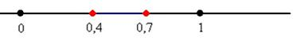
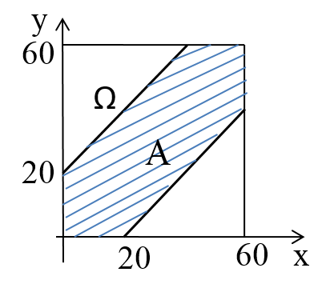

## Лекция 4. Определение вероятности. Классическое определение вероятности

[Вероятность](../../GLOSSARY.md#вероятность) является одним из основных понятий теории вероятностей. Существует несколько определений этого понятия. Одно из основных – это классическое определение. Это определение применимо в случаях, когда удается выделить [полную группу](../../GLOSSARY.md#полная-группа-случайных-событий) несовместных и равновероятных событий, т.е. элементарных исходов.

[Вероятностью](../../GLOSSARY.md#вероятность) события А называют отношение числа m благоприятствующих этому событию исходов к общему числу n всех элементарных исходов:

$$ P(A) = {m \over n} $$

### Примеры непосредственного вычисления вероятности

*Задача 1*.

Набирая номер телефона, абонент забыл одну цифру и набрал ее наудачу. Найдите вероятность того, что набрана нужная цифра. *Ответ: 0,1*

*Задача 2*.

В группе 25 студентов. Из них 10 девушек и 15 юношей. Наугад выбирают одного студента. Найти вероятность того, что выберут юношу.

*Решение.* Искомая вероятность:

$$ P(A)= {15 \over 25} = {3 \over 5} = 0,6 $$

*Задача 3*.

В группе 15 студентов. Из них 5 девушек и 10 юношей. Выбирают 3 студентов. Найти вероятность того, что из трёх выбранных студентов выберут одну девушку и двух юношей.

*Решение.* При вычислении вероятности события необходимо обратиться к разделу [комбинаторики](../../GLOSSARY.md#комбинаторика). Для данной задачи следует подсчитать различные сочетания по формуле (3.3).

Искомая вероятность:

$$ P(A) = {C_5^1⋅C_{10}^2 \over C_{15}^3} = {45⋅5 \over 455} = {45 \over 91} $$

Классическое определение вероятности оказывается эффективным для решения целого спектра задач, но с другой стороны, обладает и рядом недостатков. Даже правильнее сказать, не недостатков, а ограничений. 

Одним из таких ограничений является тот факт, что оно неприменимо к испытаниям с бесконечным количеством исходов.

*Задача 4*. 

На отрезок [0;1] наудачу бросается точка. Какова вероятность того, что она попадёт в промежуток[0,4;0,7]?

Поскольку на отрезке бесконечно много точек, то здесь нельзя применить формулу $$ P(A) = {m \over n} $$ (*ввиду бесконечно большого значения «эн»*) и поэтому на помощь приходит другой подход, называемый **геометрическим определением вероятности**.

Всё очень похоже: вероятность наступления некоторого события $$ А $$ в испытании равна отношению $$ P(A) = {g \over Q} $$, где $$ Q $$ –  *геометрическая мера*, выражающая общее число **всех возможных** и **равновозможных** исходов данного испытания, а $$ g $$ – *мера*, выражающая количество благоприятствующих событию $$ A  $$ исходов. На практике в качестве такой геометрической меры чаще всего выступает длина или площадь, реже – объём.

В нашей задаче $$ P(A)={0,7 - 0,4 \over 1-0 } = 0,3 $$

*Задача 5 (о встрече)*.

Двое студентов договорились встретиться между восемью и девятью часами вечера. Каждый пришедший ждет другого в течение двадцати минут, а затем (если встреча не состоялась) уходит. Найти вероятность того, что встреча произойдет, если каждый из них выбирает момент своего прихода независимо от другого и не отдает предпочтения никаким моментам назначенного для встречи часа.

*Решение.*

Элементарным исходом (событием) в данной задаче является точка на плоскости, задающая моменты прихода двух студентов на встречу. Пусть x- момент прихода одного из них, y – момент прихода другого, которые отсчитываются в минутах, начиная с восьми часов. Тогда пространство элементарных исходов представляет собой множество точек квадрата размером 60·60:
$$ \varOmega = \begin{cases}
   0 \leq x \leq 60  \\
   0 \leq y \leq 60  
\end{cases} $$

Пусть событие А состоит в том, что встреча студентов состоится. Множество элементарных исходов , благоприятствующих А, есть множество точек квадрата, удовлетворяющих неравенству $$ |x - y| \leq 20 $$, то есть
$$ А = \begin{cases}
   x - y \leq 20  \\
   y - x \leq 20  
\end{cases} $$

Воспользуемся геометрическим определением вероятности, для этого вычислим площади фигур А и Ω. 

$$ S_\varOmega = 60·60 =3600 $$;

$$ S_A = 3600 - 40·40 =2000 $$.
    
По формуле  $$ P(A) = {g \over Q} = {2000 \over 3600} \approx 0,5555 $$

**Относительной частотой события** называют отношение числа испытаний, в которых событие появилось, к общему числу практически произведенных испытаний. Таким образом, относительная частота А определяется формулой:

$$ W(A) = {m \over n} $$,

где $$ m $$ - число появлений события, $$n$$ - общее число испытаний.

Сопоставляя определение вероятности и относительной частоты, заключаем: определение вероятности не требует, чтобы испытания производились в действительности; определение же относительной частоты предполагает, что испытания были произведены фактически. Другими словами, вероятность вычисляют до опыта, а относительную частоту - после опыта.

*Задача 6*. Из 80 случайно выбранных сотрудников 3 человека имеют серьезные нарушения сердечной деятельности. Относительная частота появления людей с больным сердцем

$$ W(A) = {3 \over 80} $$

При статистическом определении в качестве вероятности события принимается его относительная частота. Таким образом, статистическая вероятность $$ P_N(A) $$  появления события $$A$$ в $$N$$ испытаниях есть отношение   $$ P_N = {N_A \over N} $$ числа $$N$$ испытаний, в которых событие $$A$$ произошло, к общему числу испытаний.

*Задача 7.* Статистическая вероятность попадания в цель при 75 выстрелах равна 0,6. Сколько было попаданий?

*Решение.* 

Так как  $$ P_N = {N_A \over N} $$,

где $$N$$ - число выстрелов, а $$N_A$$ — число попаданий, то $$N_A = P_N·N$$ 

Подставляя исходные данные, получим $$N_A = 0,6·75 = 45$$.

*Ответ*: 45 попаданий.

*Задача 8*. Для пошива школьных форм было заказано 2200 пуговиц. При проверке партии из 500 пуговиц было обнаружено 6 бракованных. Какое наименьшее количество запасных пуговиц необходимо еще заказать, чтобы исключить брак?

*Решение*. 

Статистическая частота брака будет составлять $${6 \over 500} $$, тогда среди 2200 пуговиц число бракованных $$ 2200· {6 \over 500} = 26,4 $$. Округлив это число до наибольшего ближайшего целого, получим 27 пуговиц.

*Ответ*: чтобы исключить брак, необходимо дозаказать не менее 27 пуговиц.

<quiz id="test" name="<h3> Выполните тестовое задание по материалу лекции</h3>">
    <question>
        
Вероятность появления события, в которых $$m$$ – число благоприятных исходов, $$n$$ – число всех возможных исходов, находится по формуле ...

        <answer>$$P(A) = {-m \over n}$$</answer>
        <answer>$$P(A) = n!$$</answer>
        <answer correct>$$P(A) = {m \over n}$$</answer>
        <answer>$$P(A) = {m! \over n!}$$</answer>
    </question>
    <question>
        
Какова вероятность того, что на двух брошенных игральных костях в сумме выпадет 10 очков?

        <answer>$$0,1$$</answer>
        <answer correct>$${1 \over 12}$$</answer>
        <answer>$$0,25$$</answer>
        <answer>$$1$$</answer>
    </question>
    <question>
        
Из пяти карточек с буквами А, Б, В, Г, Д наугад выбирают три и располагают в ряд. Какова вероятность, что получится слово «ДВА»?

        <answer correct>$${1 \over 60}$$</answer>
        <answer>$${1 \over 3}$$</answer>
        <answer>$${1 \over 2}$$</answer>
        <answer>$$1$$</answer>
    </question>
    <question>
        
Вероятность появления события принимает значения на интервале ...

        <answer>$$(0; 1)$$</answer>
        <answer>$$(-1; 1)$$</answer>
        <answer correct>$$[0; 1]$$</answer>
        <answer>$$(-∞; ∞)$$</answer>
    </question>
</quiz>