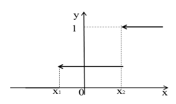
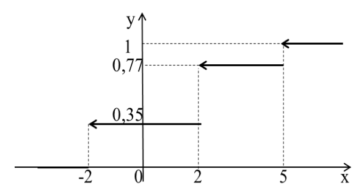
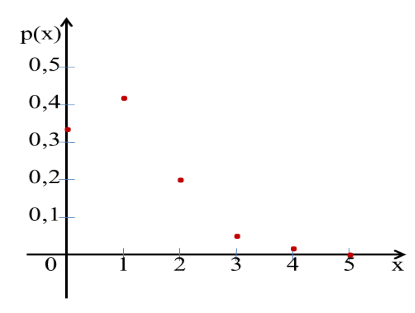
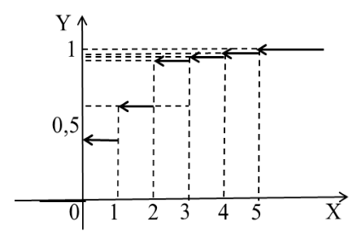

## Лекция 7. Дискретные случайные величины

В том случае, если случайное событие выражается в виде числа, можно говорить о случайной величине. [Случайной](../../GLOSSARY.md#случайная) называют величину, которая в результате испытания примет одно возможное значение, наперёд неизвестное и зависящее от случайных причин, которые заранее не могут быть учтены.

Среди случайных величин выделяют дискретные и непрерывные случайные величины.

[Дискретной случайной величиной](../../GLOSSARY.md#дискретная-случайная-величина) называется случайная величина, которая в результате испытания принимает отдельные значения с определёнными вероятностями. Число возможных значений дискретной случайной величины может быть конечным и бесконечным. 

Примеры дискретной случайной величины: запись показаний спидометра или измерений температуры в **конкретные моменты** времени.

Случайные величины обозначают прописными буквами латинского алфавита X, Y, Z,..., а значения, которые они принимают, - соответственно строчными: x,y,...

Правило, устанавливающее связь между значением [СВ](../../GLOSSARY.md#случайная) и ее вероятностью, называется [законом распределения СВ](../../GLOSSARY.md#закон-распределения).

Например, [ДСВ](../../GLOSSARY.md#дискретная-случайная-величина) X представляет собой конечный (или бесконечный) ряд чисел $$ x_1, x_2, x_3, ...x_n, ...$$. Если заданы вероятности $$p_1, p_2, p_3, ...p_n, ...$$, то его называют [рядом распределений](../../GLOSSARY.md#ряд-распределений). Обычно закон распределения ДСВ задается в виде таблицы, в первой строке которой расположены значения ДСВ, во второй  - соответствующие им вероятности.

| $$x_1$$ | $$x_2$$ | $$x_3$$ | $$x_4$$ | ... | $$x_n$$ |
| ------- | ------- | ------- | ------- | --- | ------- |
| $$p_1$$ | $$p_2$$ | $$p_3$$ | $$p_4$$ | ... | $$p_n$$ |

При этом сумма вероятностей всех возможных значений ДСВ равна 1:

> $$ \textstyle\sum_{i=1}^n p_i=1$$

*Задача 1*.

В результате подбрасывания двух игральных костей появляется некоторое число X – случайная величина, характеризующая сумму выпавших очков с определенной вероятностью. Найдите закон распределения случайной величины X. Величина Х может принимать значения от 2 до 12

| $$x_i$$ | 2 | 3 | 4 | 5 | 6 | 7 | 8 | 9 | 10 | 11 | 12 |
| ------- | - | - | - | - | - | - | - | - | -- | -- | -- |
| $$p_i$$ | $${1 \over 36}$$  | $${2 \over 36}$$  | $${3 \over 36}$$  | $${4 \over 36}$$  | $${5 \over 36}$$  |  $${6 \over 36}$$ | $${5 \over 36}$$  | $${4 \over 36}$$  |  $${3 \over 36}$$  |  $${2 \over 36}$$  |  $${1 \over 36}$$  |  

ДСВ считается заданной, если указан закон ее распределения, т.е. известны все значения ДСВ и вероятность каждого из них.

Математические законы теории вероятностей получены в результате обобщения закономерностей массовых явлений природы и общества. Под массовостью в данном случае понимается значительное число повторяющихся испытаний в одинаковых или сходных условиях. При изучении массовых явлений особую роль играет группа теорем, известная в математике под названием **закон больших чисел**. 

Благодаря этим теоремам, устанавливаются закономерности, возникшие в результате наложения большого числа случайных факторов. Так, одной из установленных закономерностей СВ является предсказуемость результатов: при определенных условиях СВ начинает вести себя не как случайная. При суммировании большого числа случайных величин закон распределения их суммы при соблюдении ряда условий близок к **нормальному**. 

С другой стороны, под законом больших чисел понимают давно установленное (наблюдаемое) свойство устойчивости массовых случайных явлений, смысл которого в том, что средний результат действия большого числа случайных явлений становится практически неслучайным, т.е. может быть достаточно точно предсказан. Благодаря закону больших чисел появляется возможность делать научные прогнозы случайных явлений с достаточно высокой точностью, а также оценивать точность этих прогнозов.

Особую роль играют различные формы **центральной предельной теоремы**, так как устанавливают условия возникновения **нормального закона распределения**.

[Нормальное распределение](../../GLOSSARY.md#нормальное-распределение) часто встречается в природе. Например, следующие случайные величины хорошо моделируются нормальным распределением:

* отклонение при стрельбе;
* погрешности измерений (однако погрешности некоторых измерительных приборов имеют иное распределение);
* некоторые характеристики живых организмов в популяции.

Поскольку каждому значению $$х$$ ДСВ ставится в соответствие ее вероятность, то закон распределения можно задавать с помощью функции распределения ДСВ.

Существуют разные законы распределения СВ: *равномерное распределение, показательное, нормальное, биноминальное и т.д.*

[Функцией распределения](../../GLOSSARY.md#функция-распределения) $$F(x)$$ ДСВ $$ξ$$ называется вероятность события $$ξ < х$$:

$$ F(x) = Р(ξ < х)$$.

Свойства функции распределения ДСВ:

1. Функция непрерывна при  $$x \not = x_i$$ и имеет разрывы при  $$х = x_i$$;
2. Функция распределения постоянна на полуинтервале $$(x_i; x_{i+1}]$$;
3. $$F(x) = \textstyle\sum_{x_i < x}p_i$$ -  свойство накопительной вероятности.

$$ F(x)=\begin{cases}
   0 &\text{при } x \leq x_1 \\
   p_1 &\text{при } x_1 < x \leq x_2 \\
   1 &\text{при } x > x_2
\end{cases}$$

График функции распределения произвольной ДСВ представляет собой «возрастающую ступеньку»

*Задача 2.* 

[Дискретная случайная величина](../../GLOSSARY.md#дискретная-случайная-величина) задана рядом распределений:

| $$x_i$$ | -2  | 2 | 5 |
| ------- | --- |-|--|
|$$Р(x_i)$$|0,35|0,42|0,23|

Составьте функцию распределения и постройте ее график.

*Решение*.  $$F(x)=\begin{cases}
   0 &\text{при } & x \leq -2 \\
   0,35 &\text{при } & -2 < x \leq 2 \\
   0,77 &\text{при } & 2 < x \leq 5 \\
   1 &\text{при } & x > 5
\end{cases}$$

График функции

*Задача 3. *

В мастерской ремонтируют пять машин. Вероятность того, что любая из машин отремонтирована, равна 0,2. Случайная величина Х – число отремонтированных машин. 

1. Cоставьте закон распределений ДСВ и постройте его график;
2. Cоставьте функцию распределения, постройте ее график.

*Решение*. 

а) Число отремонтированных машин может быть: 0,1,2,3,4,5. Найдем вероятность каждого случая, используя формулу Бернулли.

$$Р(0) = 0,8^5 =0,32768$$

$$Р(1) = C{1 \atop 5} · 0,2^1 · 0,8^4 = 5 · 0,2 · 0,4096 = 0,4096$$     

$$Р(2) = C{2\atop 5} · 0,2^2 · 0,8^3 = 0,2048$$

$$Р(3) = C{3\atop 5} · 0,2^3 · 0,8^2 = 0,0512$$

$$Р(4) = C{4\atop 5} · 0,2^4 · 0,8^1 = 0,0064$$

$$Р(5) = 0,2^5 = 0,00032$$

Составим закон распределений в виде ряда:

| $$x_i$$ | 0  | 1 | 2 | 3 | 4 | 5 |
| ------- | -- |---|---|---|---|---|
| $$p_i$$ |0,32768|0,4096|0,2048|0,0512|0,0064|0,00032|

Построим график закона:

б) $$F(x)=\begin{cases}
   0 &\text{при } & x \leq 0 \\
   0,32768 &\text{при } & 0 < x \leq 1 \\
   0,73728 &\text{при } & 1 < x \leq 2 \\
   0,94208 &\text{при } & 2 < x \leq 3 \\
   0,99328 &\text{при } & 3 < x \leq 4 \\
   0,99968 &\text{при } & 4 < x \leq 5 \\
   1 &\text{при } & x > 5
\end{cases}$$

График функции распределения имеет вид:

<quiz id="test" name="<h3> Выполните тестовое задание по материалу лекции</h3>">
    <question>
        

        <answer></answer>
        <answer></answer>
        <answer></answer>
        <answer></answer>
    </question>
    <question>
        

        <answer></answer>
        <answer></answer>
        <answer></answer>
        <answer></answer>
    </question>
    <question>
        

        <answer></answer>
        <answer></answer>
        <answer></answer>
        <answer></answer>
    </question>
    <question>
        

        <answer></answer>
        <answer></answer>
        <answer></answer>
        <answer></answer>
    </question>
    <question>
        

        <answer></answer>
        <answer></answer>
        <answer></answer>
        <answer></answer>
    </question>
</quiz>