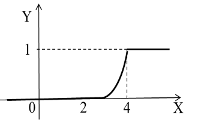
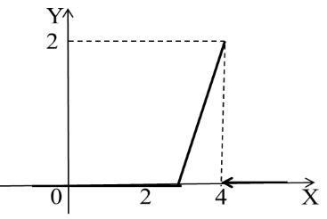

## Лекция 9. Понятие непрерывной случайной величины

[Непрерывной случайной величиной](../../GLOSSARY.md/#непрерывная-случайная-величина) называют случайную величину, которая в результате испытания принимает все значения из некоторого числового промежутка. Число возможных значений непрерывной случайной величины бесконечно. 

Пример непрерывной случайной величины: запись показаний спидометра или измерений датчика температуры в течение конкретного интервала времени.

Результат эксперимента $$\xi$$ будем называть  ([СВ](../../GLOSSARY.md/#случайная)), если для любого $$x ∈ R$$ неравенство $$\xi < x$$ является событием, т.е. определена вероятность $$Р(\xi < x)$$. Эта вероятность как функция от х называется функцией распределения (ФР) случайной величины $$\xi$$ и обозначается $$F(х)$$.

Функцией распределения НСВ называют вероятность того, что случайная величина $$\xi$$ в результате испытания примет значение меньше $$х$$:

 $$F(х) = Р(\xi < х)$$.

Свойства функции.

1. Функция распределения монотонно не убывает;
2. $$\lim\limits_{x\to\infty}F(х) = 1$$
3. $$\lim\limits_{x\to -\infty}F(х) = 0$$
4. Функция непрерывна слева при любом значении $$х$$;
5. Вероятность того, что случайная величина $$\xi$$ примет значение в полуинтервале [а; в), равна $$P\{а \leq \xi < в\} = F(в) - F(а)$$

*Задача 1*.

Случайная величина Х задана функцией распределения $$F(x)$$:

$$ F(x)=\begin{cases}
   0 &\text{при } x \leq -1; \\
   {3 \over 4}x +{3 \over 4} &\text{при } -1 < x \leq {1 \over 3}; \\
   1 &\text{при } x > {1 \over 3}.
\end{cases}$$

Найдите вероятность того, что в результате испытания величина Х примет значение, заключенное в интервале $$(0; {1 \over 3})$$.

*Решение*.

Вероятность того, что в результате испытания величина Х примет значение, заключенное в интервале (a;b), равна приращению функции распределения на этом интервале:

$$Р(a < x < b) = F(b) – F(a)$$.

Отсюда $$Р(0 < x < {1 \over 3}) = F({1 \over 3}) – F(0) = ({3 \over 4}·{1 \over 3}+{3 \over 4}) - ({3 \over 4}·0+{3 \over 4}) = {1 \over 4}$$.

*Ответ*: $$ {1 \over 4} $$.

*Задача 2*.

Случайная величина Х задана функцией распределения F(x):

$$ F(x)=\begin{cases}
   0 &\text{при } x \leq -2; \\
   {1 \over 2}x +{1 \over \pi} &\text{при } -2 < x \leq 2; \\
   1 &\text{при } x > 2.
\end{cases}$$

Найдите вероятность того, что в результате испытания величина Х примет значение, заключенное в интервале (-1; 1).

*Предлагается решить самостоятельно*.

*Задача 3*.

Случайная величина Х задана функцией распределения F(x):

$$ F(x)=\begin{cases}
   0 &\text{при } x \leq 2; \\
   0,5x -1 &\text{при } 2 < x \leq 4; \\
   1 &\text{при } x > 4.
\end{cases}$$

Найдите вероятность того, что в результате испытания величина Х примет значение:

* а) меньше 0,2;
* б) меньше трех;
* в) не меньше трех;
* г) не меньше пяти.

*Решение.*

а) Так как при $$x \leq 2$$ функция $$F(x) = 0$$, то $$F(0; 2) = 0$$, т.е. $$Р(x < 2) = 0$$;

б) $$Р(x < 3) = F(3) = 0,5·3 - 1 = 0,5$$;

в) события  $$X ≥ 3$$  и $$X < 3$$ противоположны, поэтому $$Р(X ≥ 3) = 1 - Р(x < 3) = 1 - 0,5 = 0,5$$;

г) сумма вероятностей [противоположных событий](../../GLOSSARY.md#противоположные-события) равна 1. События  $$X ≥ 5$$  и $$X < 5$$ противоположны. А т. к. при  $$x > 4$$ $$F(x) = 1$$, то $$Р(X ≥ 5) = 1 - Р(x < 5) = 1 - F(5) = 1 - 1 = 0$$.

*Определение*.

Плотностью распределения НСВ называют первую производную от функции распределения: $$f(x) = F'(x)$$. Плотность обозначается $$р(х)$$, значит
$$F(х) = \textstyle\int_{-\infty}^xf(t)dt$$ (несобственные интегралы в программу Элементы высшей математики не входят)

*Задача 5*. 

Найдите плотность распределения функции. Постройте графики функции и плотности. 

$$ F(x)=\begin{cases}
   0 &\text{при } x \leq 3; \\
   (x-3)^2 &\text{при } 3 < x \leq 4; \\
   1 &\text{при } x > 4.
\end{cases}$$

*Решение.* 

$$ p(x) = F'(x)=\begin{cases}
   0 &\text{при } x \leq 3; \\
   2x - 6 &\text{при } 3 < x \leq 4; \\
   0 &\text{при } x > 4.
\end{cases}$$

График функции $$F(x)$$

График плотности $$p(x)$$

<quiz id="test" name="<h3> Выполните тестовое задание по материалу лекции</h3>">
    <question>
        
Функция распределения НСВ принимает значения на промежутке ...

        <answer>(0; 1)</answer>
        <answer>(-1; 1)</answer>
        <answer correct>[0; 1]</answer>
        <answer>(-∞; ∞)</answer>
    </question>
    <question>
        
Вероятность того, что случайная величина ξ примет значение в полуинтервале [а; в), равна ...

        <answer>$$P{ а ≤ξ< в} = F(в)$$</answer>
        <answer>$$P{ а ≤ξ< в} = F(а)$$</answer>
        <answer>1</answer>
        <answer correct>$$P{ а ≤ξ< в} = F(в) - F(а)$$</answer>
    </question>
    <question>
        
Плотностью распределения НСВ называют ...

        <answer>математическое ожидание НСВ</answer>
        <answer correct>первую производную от функции распределения НСВ</answer>
        <answer>дисперсию НСВ</answer>
        <answer>вероятность появления достоверного события</answer>
    </question>
    <question>
        
Случайная величина $$Х$$ задана функцией распределения $$F(x)$$: 
        $$F(x) = \begin{cases}
           0 &\text{при } & x \leq 0 \\
           {1 \over 2}x^2 &\text{при } & 0 < x \leq \sqrt{2} \\
           1 &\text{при } & x > \sqrt{2}
            \end{cases}$$ 
            Найдите вероятность попадания НСВ в заданный интервал $$({1 \over 6};{1 \over 3})$$
        

        <answer>0</answer>
        <answer>$${1 \over 72}$$</answer>
        <answer>$${1 \over 2}$$</answer>
        <answer correct>$${1 \over 24}$$</answer>
    </question>
</quiz>