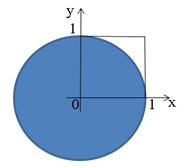

## Лекция 12 Общая идея метода статистических испытаний

Практически во всех вероятностных задачах удается установить формальную зависимость конечного результата от исходных данных, т.е получить аналитическое решение задачи. Если этого сделать нельзя, то используют метод статистических испытаний.

**Основная идея метода**: вместо аналитического решения задачи либо проводят эксперименты, испытания, непосредственно рассматриваемые в задаче, либо эти испытания заменяют другими, имеющими с исходными одинаковую вероятностную структуру (т.е. рассматриваемые в задаче случайные явления имитируют, моделируют другими случайными явлениями).

Определенные по результатам достаточно большого числа испытаний характеристики случайных явлений (относительные частоты, средние арифметические) используют в качестве приближенного решения задачи (в качестве оценок вероятностей, математических ожиданий). Допустимость этого приближения основывается на законе больших чисел.

Метод статистических испытаний применяют для решения не только тех задач, в которых в явном виде имеются случайные явления, но так же и для решения многих математических задач, не содержащих таких явлений. В этом случае искусственно подбирают такое случайное явление, характеристики которого связаны с результатами решения исходной задачи. Для определения числовых значений этих характеристик используется метод статистических испытаний.

Т.к. достаточно высокая точность решения при использовании метода статистических испытаний гарантируется, как правило, только при проведении большого числа испытаний, этот метод можно реализовать только на ЭВМ. Поэтому данный метод часто называют «машинным».

Аппаратные генераторы случайных чисел главным образом применяются для проведения статистических испытаний и в криптографии, где они используются для создания криптографических ключей для зашифрованной передачи данных. Также такие устройства широко используются в интернет-казино для имитации, например, рулетки. Но из-за сложности реализации и относительной медленности использование подобных генераторов зависит от потребностей конкретной предметной области и от устройства самого генератора.

Таблица случайных чисел от 0 до 100 (при составлении повторный выбор был запрещен)

|54|49|37|73|67|10|79|100|11|03|26|59|61|01|04|23|68|32|89|18|
|--|--|--|--|--|--|--|---|--|--|--|--|--|--|--|--|--|--|--|--|
|81|94|30|46|25|87|78|75|85 |56|42|14|66|38|69|76|82|13|70|28|
|98|90|07|71|17|84|33|52|80 |44|51|08|86|99|31|43|35|58|64|93|
|36|74|63|20|50|62|92|06|16 |88|00|45|60|29|95|39|02|15|91|65|
|57|09|83|40|12|48|96|24|41 |05|55|19|77|34|21|47|97|72|22|27|

В ходе статистических испытаний важно оценить точность смоделированного процесса, т.е. найти величину ошибки. 

Искомая верхняя граница $$\delta$$ есть точность оценки математического ожидания по выборочной средней, которая участвует в построении доверительных интервалов.

Возможны различные случаи.

1. Случайная величина Х распределена нормально Хϵ N($$m$$;$$\sigma$$) с известным среднеквадратическим отклонением $$\sigma$$. Это значит, что с надежностью $$\gamma$$ верхняя граница ошибки равна
 $$\delta = t{\sigma \over \sqrt{n}}$$, где $$n$$ - число испытаний, $$t$$ - значение аргумента [функции Лапласа](../pril2.md), при котором $$\varPhi(t) = \gamma \over 2$$, т.к. $$2\varPhi(t) = \gamma$$.

*Задача 1*. 

С надежностью  $$ \gamma = 0,95$$ найти верхнюю границу ошибки для оценки математического ожидания случайной величины Хϵ N($$m$$; 0,6), если было разыграно 25 возможных значений $$n$$. 

*Решение*. 

Имеем  $$ \gamma = 0,95$$,  $$\delta = 0,6$$, $$n = 25$$,  

$$\varPhi(t) = {\gamma \over 2} = {0,95 \over 2} = 0,475$$

Из таблицы [Приложение 2](../pril2.md) по значению функции Лапласа, равному 0,475, найдем аргумент $$t = 1,96$$

По формуле $$\delta = t{\sigma \over \sqrt{n}}$$  найдем верхнюю границу  $$\delta = {1,96·0,6 \over \sqrt{25}} = 0,2352$$.

2. Случайная величина Х распределена нормально, но ее среднеквадратическое отклонение  неизвестно.

В этом случае для оценки  принимают значение исправленного среднеквадратического отклонения как несмещенную оценку 
$$\delta = t_\gamma{S \over \sqrt{n}}$$, где $$t_\gamma$$ находится как аргумент в распределении Стьюдента. 

*Задача 2*. 

Найти верхнюю границу ошибки с надежностью $$ \gamma = 0,95$$, если для оценки математического ожидания было разыграно 100 возможных значений Х и по этим данным найдено «исправленное» среднеквадратическое отклонение $$S = 0,4$$.

*Решение*. 

По условию  $$ \gamma = 0,95$$, найдем $$t_\gamma = 1,98$$; по формуле $$\delta = t_\gamma{S \over \sqrt{n}}$$ определим верхнюю границу $$\delta = {1,98·0,4  \over \sqrt{100}} = 0,079$$

### [Разыгрывание дискретных случайных величин](../../GLOSSARY.md/#разыгрывание-дискретных-случайных-величин)

Разыграть [ДСВ](../../GLOSSARY.md/#дискретная-случайная-величина) Х – это значит, что надо получить последовательность ее возможных значений $$x_i$$ по известным вероятностям.

*Задача 3*. 

По заданным вероятностям четырех событий, образующих полную группу событий $$p_1 = P(A_1) = 0,18$$; $$p_2 = P(A_2) = 0,25;$$ $$p_3 = P(A_3) = 0,36$$; $$p_4 = P(A_4) = 0,21$$ разыграть пять испытаний, в каждом из которых должно появиться одно из этих событий.

*Решение*. 

По правилу разыгрывания полной группы событий надо разыграть ДСВ, имеющую закон распределения 

|$$x$$|1|2|3|4|
|-----|-|-|-|-|
|$$p$$|0,18|0,25|0,36|0,21|

По правилу разыгрывания ДСВ разобьем интервал $$(0; 1)$$ на четыре частных интервала: $$\varDelta_1 = (0; 0,18)$$, $$\varDelta_2 = (0,18; 0,43)$$, $$\varDelta_3 = (0,43;0,79)$$, $$\varDelta_4 = (0,79; 1)$$.

Выберем из ТСЧ пять случайных чисел: 0,56; 0,82; 0,78;0,75; 0,86.

Т.к. число  $$0,56\in \varDelta_3$$, то наступит событие $$A_3$$, $$0,82\in \varDelta_4$$ - то наступит событие $$A_4$$, $$0,78 \in \varDelta_3$$ - $$A_3$$, $$0,75 \in \varDelta_3$$ - $$A_3$$, $$0,86 \in \varDelta_4$$  - $$A_4$$. События распределились следующим образом: $$A_3; A_4; A_3; A_3; A_4$$.

Ответ: $$A_3; A_4; A_3; A_3; A_4$$

*Задача 4*. 

События $$А$$ и $$В$$ независимы и совместны. Разыграть пять испытаний, в каждом из которых $$Р(А) = 0,7$$; $$Р(В) = 0,1$$.

*Решение*. 

Разберем все возможные исходы в результате одного испытания.

$$M_1 = А·В, Р(M_1) = 0,7·0,1=0,07$$;

$$M_2 = А·\overline{B}, Р(M_2) = 0,7·0,9 = 0,63$$;

$$M_3 = \overline{A}·В, Р(M_3) = 0,3·0,1 = 0,03$$;

$$M_4 = \overline{A}·\overline{B}, Р(M_4) = 0,3·0,9 = 0,27$$.

Построим частные интервалы: $$\varDelta_1 = (0; 0,07)$$, $$\varDelta_2 = (0,07; 0,7)$$, $$\varDelta_3 = (0,7;0,73)$$, $$\varDelta_4 = (0,73; 1)$$.

Случайные числа: 0,23; 0,018; 0,93; 0,64; 0,48

$$ 0,23\in \varDelta_2 -M_2$$;  $$0,018 \in \varDelta_1 - M_1$$; $$0,93 \in \varDelta_4 - M_4$$;  $$0,64 \in \varDelta_3 - M_3$$;  $$0,48 \in \varDelta_2 - M_2$$. События распределились следующим образом: $$ M_2;M_1;M_4;M_3;M_2 $$, т.е. $$А·\overline{B}, А·В, \overline{A}·\overline{B}, \overline{A}·В,  А·\overline{B}$$.

Ответ: $$А·\overline{B}, А·В, \overline{A}·\overline{B}, \overline{A}·В,  А·\overline{B}$$.

*Задача 5*. (*случайный выбор одной из альтернатив, каждая из которых имеет свой вес*). 

Ряд практических задач связан с выбором одного из возможных вариантов , каждый из которой имеет определенный вес. Подобные задачи можно решать, как предыдущую, заменив вероятность на величину соответствующего веса по формуле $$p^* = {q(x_i) \over \sum q(x_i)}$$.

Идея решения задачи основана на попадании случайной точки в один из интервалов, каждый из которых пропорционален величине $$q(x_i)$$.

Пусть, например, имеются четыре альтернативы  $$x_1, x_2, x_3, x_4$$

Вес каждой из которых $$q(x_1) = 9; q(x_2) = 12; q(x_3) = 7; q(x_4) = 5$$.    Выбрать альтернативу при выпадении случайного числа $$r = 0,53$$. 

*Решение*. 

Рассмотрим полную группу событий , состоящую из четырех событий, вероятность заменим относительным весом соответствующей альтернативы по формуле $$p^* = {q(x_i) \over \sum q(x_i)}$$. 

1. По правилу разыгрывания полной группы событий надо разыграть ДСВ,  имеющую закон распределения:

|$$i$$|1|2|3|4|
|-----|-|-|-|-|
|$$p^*(x_i)$$|$${9 \over 33}$$|$${12 \over 33}$$|$${7 \over 33}$$|$${4 \over 33}$$|

2. По правилу разыгрывания ДСВ разобьем интервал $$(0;1)$$ на четыре частных интервала $$\varDelta_1 = (0; 0,27)$$, $$\varDelta_2 = (0,27; 0,63)$$, $$\varDelta_3 = (0,63; 0,84)$$, $$\varDelta_4 = (0,84; 1)$$.
   
Так как случайное число $$r = 0,53 \in \varDelta_2$$, выбирается вторая альтернатива.

*Ответ*: $$x_2$$.

### [Разыгрывание непрерывных случайных величин](../../GLOSSARY.md/#разыгрывание-непрерывных-случайных-величин).

Разыграть НСВ Х – это значит, что надо получить последовательность ее возможных значений $$x_i$$ по функции распределения $$F(x)$$ или по плотности вероятности  $$f(x)$$.

*Задача 6*. 

Вычислить значение числа π методом статистических испытаний.

*Решение*. 

Числом $$\pi$$ называется отношение длины окружности к диаметру.

$$ С = 2·\pi·R; d = 2·R$$. В процессе решения этой задачи проследим механизм реализации метода статистических испытаний. Разыграем значения равномерного распределения, каждое из которых с одинаковой вероятностью может находиться в любой точке квадрата, в который вписана четверть круга радиусом, равным стороне квадрата.

Обозначим А событие «попадание в круг некоторой точки с координатами $$(x;y)$$». Возьмем круг с центром в начале координат и радиусом $$R = 1$$.

Тогда, согласно геометрическому определению вероятности события $$А$$, имеем $$P(A) = {S_{круга} \over S_{квадр.}}$$. $$ {1 \over 4}S_{круга} ={1 \over 4}\pi·R^2 = {\pi \over 4}$$.

Пусть разыгрывается $$N$$ точек, среди которых $$N_0$$  попадают в четверть круга. Тогда за отношение площадей фигур можно принять отношение числа точек, попавших в четверть круга, к общему числу разыгранных точек.  Поэтому  $${S_{круга} \over S_{квадр.}} = {\pi \over 4} = P(A)$$ т.е. $$ \pi \approx 4P(A) = 4·{N_0 \over N}$$.

 Т.к. для создания испытаний у нас сейчас нет оборудования, то воспользуемся ТСЧ. Будем разыгрывать 10 точек. Возьмем из ТСЧ  
 
0, 25; 0, 87; 0, 78; 0, 75; 0, 85; 0, 56; 0, 42; 0, 14; 0, 66; 0, 38 – это абсциссы случайных точек.

0, 20; 0, 50; 0, 62; 0, 92; 0, 60; 0, 16; 0, 88; 0, 00; 0, 45; 0, 60 –это ординаты случайных точек.

(0,25;0,2), (0,87;0,50), (0,78;0,62), (0,75;0,92), (0,85;0,60), (0,56;0,16), (0,42;0,88), (0,14;0,00), (0,66;0,45), (0,38;0,60)

Чтобы узнать, какие из них попадут в четверть круга, воспользуемся теоремой Пифагора.

$$R = \sqrt{0,25^2 + 0,2^2} \approx 0,32$$

$$R = \sqrt{0,87^2 + 0,5^2} \approx 1,12$$

$$R = \sqrt{0,78^2 + 0,62^2} \approx 1,16$$

$$R = \sqrt{0,75^2 + 0,92^2} \approx 1,6$$

$$R = \sqrt{0,85^2 + 0,6^2} \approx 1,21$$

$$R = \sqrt{0,56^2 + 0,16^2} \approx 0,59$$

$$R = \sqrt{0,42^2 + 0,88^2} \approx 1,19$$

$$R = \sqrt{0,14^2 + 0,0^2} \approx 0,14$$

$$R = \sqrt{0,66^2 + 0,45^2} \approx 0,86$$

$$R = \sqrt{0,38^2 + 0,6^2} \approx 0,74$$

$$\pi \approx 4·P(A) = 4·{5 \over 10} \approx 2$$

*Значение имеет очень грубое приближение, так как разыгрывалось очень мало точек.*
